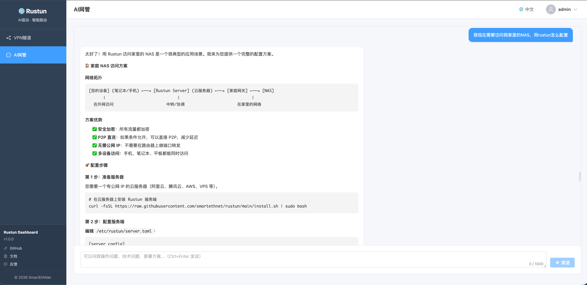

# Rustun Dashboard (Generated By AI)

Dashboard for Rustun project with Vue frontend and Golang backend.

**🤖 Now with AI-Driven VPN Management!**




## Features

- 📊 **Visual Network Topology** - Visualize your VPN network with interactive topology map
- 🤖 **AI-Powered Management** - Manage VPN tunnels through natural language conversation
- 🌐 **Multi-language Support** - Chinese and English UI
- 💾 **Flexible Storage** - File-based or database storage (MySQL/PostgreSQL/SQLite)
- 🔐 **Secure Authentication** - Basic authentication with configurable credentials
- 🎨 **Modern UI** - Built with Vue 3, Vite, Tailwind CSS, and Element Plus

## Project Structure

```
rustun-dashboard/
├── frontend/              # Vue + Vite + Tailwind + ElementPlus
│   ├── src/
│   │   ├── components/   # Vue components
│   │   ├── views/        # Page views
│   │   ├── router/       # Vue Router
│   │   ├── store/        # Pinia state management
│   │   ├── assets/       # Static assets
│   │   ├── api/          # API services
│   │   ├── main.js       # Entry point
│   │   └── App.vue       # Root component
│   ├── public/           # Public assets
│   ├── package.json
│   ├── vite.config.js
│   ├── tailwind.config.js
│   └── index.html
│
└── backend/              # Golang backend
    ├── cmd/
    │   ├── dashboard/    # Main application
    │   └── agent-cli/    # AI Agent CLI tool
    ├── internal/
    │   ├── handler/      # HTTP handlers
    │   ├── service/      # Business logic
    │   ├── model/        # Data models
    │   ├── agent/        # AI Agent core
    │   ├── ipadm/        # IP Address Management
    │   ├── repository/   # Data access layer
    │   └── middleware/   # HTTP middleware
    ├── pkg/              # Public packages
    ├── docs/             # Documentation
    ├── scripts/          # Utility scripts
    ├── go.mod
    └── config.yaml
```
